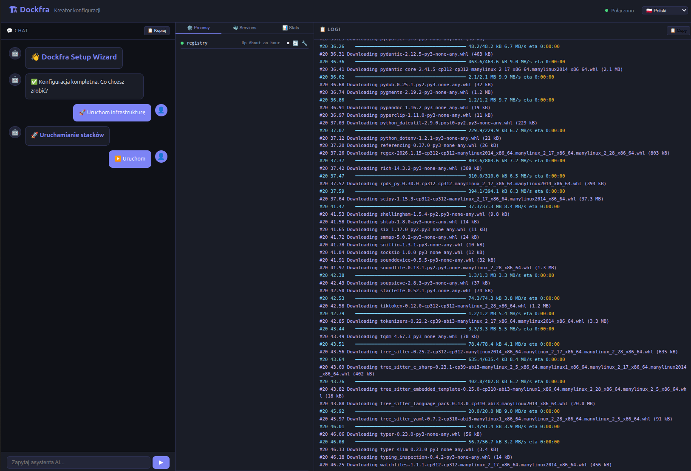
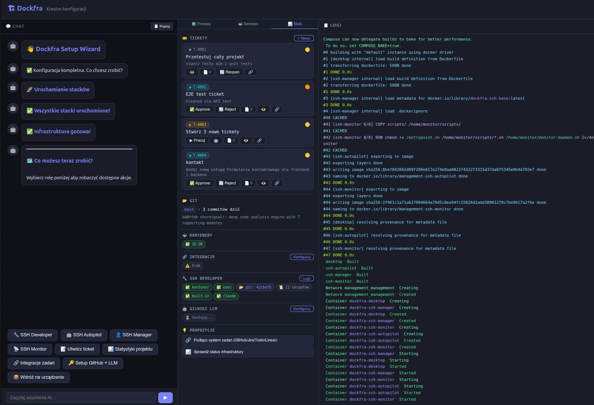

# Dockfra: Generic Docker Infrastructure Manager with AI Agents

**Manage any Docker Compose project** with an interactive web wizard, auto-discovery,
SSH-isolated AI agents, ticket-driven workflows, and autonomous orchestration.

[](CHANGELOG.md)
[](https://opensource.org/licenses/Apache-2.0)
[](https://python.org)
[](https://docs.docker.com/compose/)
[](tests/)
[-orange.svg)](docs/ARCHITECTURE.md#dev-engines)
[](#cli)
[](#architecture)

## Key Features

- **Zero-config auto-discovery** — scans for `docker-compose.yml`, parses `${VAR:-default}` env vars (55+ auto-detected)
- **Web setup wizard** — chat-based UI with inline forms, smart suggestions, ⚡ auto-detect, 10 languages
- **SSH role isolation** — 4 agent roles (Developer, Manager, Monitor, Autopilot) in isolated containers
- **5 dev engines** — Built-in LLM, [Aider](https://github.com/Aider-AI/aider), [Claude Code](https://docs.anthropic.com/en/docs/claude-code), [OpenCode](https://github.com/opencode-ai/opencode), MCP SSH Manager
- **Ticket-driven pipeline** — create → assign → implement (AI) → review → deploy → close
- **Device emulation** — `devices/` stack emulates production machines (RPi3 with SSH + HTTP/HTTPS)
- **CLI + TUI** — 14 commands: `dockfra cli test`, `engines`, `doctor`, `tickets`, `pipeline`, `dev-logs`...
- **Works with any project** — just point at a directory with `docker-compose.yml`

## 📖 Documentation

| Document | Description |
|---|---|
| **[Getting Started](docs/GETTING-STARTED.md)** | Quickstart for any Docker project |
| **[Architecture](docs/ARCHITECTURE.md)** | System design, engines, pipeline, CLI (10 modules) |
| **[Configuration](docs/CONFIGURATION.md)** | `dockfra.yaml`, ENV_SCHEMA, auto-discovery layers |
| **[SSH Roles](docs/SSH-ROLES.md)** | Role separation, commands, isolation |
| **[Wizard API](docs/WIZARD-API.md)** | REST + WebSocket API reference |
| **[Comparisons](comparisons/README.md)** | vs Kamal, Coolify, Portainer, CrewAI, OpenDevin |
| **[TODO](TODO.md)** | Current roadmap and task status |
| **[Changelog](CHANGELOG.md)** | Release history |

## Quick Start

### Any Docker Compose Project

```bash
pip install -e .
cd /path/to/your-project       # must have subdirs with docker-compose.yml
dockfra --root .               # Web wizard at http://localhost:5050
```

### Full Dockfra Infrastructure

```bash
git clone https://github.com/wronai/dockfra.git && cd dockfra
make wizard                    # Web wizard at http://localhost:5050
# or manually:
make init && make up           # Generate keys, start all stacks
```

### CLI (no browser needed)

```bash
dockfra cli                    # Interactive REPL
dockfra cli test               # Full system self-test
dockfra cli doctor             # Diagnose & fix issues
dockfra cli tickets            # List tickets
dockfra cli engines            # LLM engine status
dockfra cli dev-health         # SSH developer health
dockfra cli --tui              # Three-panel curses TUI
```

## Architecture

```
┌────────────────────────────────────────────────────────────────────┐
│ LOCAL HOST — dockfra-shared network bridge                         │
├────────────────────────────────────────────────────────────────────┤
│                                                                    │
│  management/                        app/ (auto-cloned)             │
│  ┌──────────────────────────┐      ┌────────────────────────────┐  │
│  │ • ssh-manager   :2202    │      │ • ssh-developer :2200      │  │
│  │   └ 12 scripts (tickets, │      │   └ Aider, Claude Code,    │  │
│  │     config, planning)    │◄────►│     OpenCode, Built-in LLM │  │
│  │ • ssh-autopilot :2203    │shared│ • frontend, backend        │  │
│  │   └ 4 scripts (pilot-*)  │ net  │ • db, redis, traefik       │  │
│  │ • ssh-monitor   :2201    │      └────────────────────────────┘  │
│  │   └ 8 scripts (deploy,   │                                      │
│  │     verify, analyze)     │      devices/ (production emulation) │
│  │ • desktop (VNC :6081)    │      ┌────────────────────────────┐  │
│  └──────────────────────────┘      │ • ssh-rpi3  :2224 (SSH)    │  │
│                                    │ • web-rpi3  :8090 (HTTP)   │  │
│  dockfra/ (Python package)         │ • vnc-rpi3  :6082 (VNC)    │  │
│  ┌───────────────────────────┐     │   /health, /api/status     │  │
│  │ core.py  — foundation     │     └────────────────────────────┘  │
│  │ app.py   — web + 20 APIs  │                                     │
│  │ steps.py — wizard flow    │      shared/                        │
│  │ engines.py — 5 dev engines│     ┌────────────────────────────┐  │
│  │ pipeline.py — ticket chain│     │ Dockerfile.ssh-base        │  │
│  │ cli.py  — 14 CLI commands │     │ lib/ (llm, tickets, logger)│  │
│  │ fixes.py — auto-repair    │     └────────────────────────────┘  │
│  └───────────────────────────┘                                     │
└────────────────────────────────────────────────────────────────────┘
```

### Dev Engines

| Engine | Type | Status | Description |
|---|---|---|---|
| **Built-in LLM** | OpenRouter API | ✅ | `llm_client.py` — fast, configurable, multi-model |
| **[Aider](https://github.com/Aider-AI/aider)** | CLI pair-programmer | ✅ | Auto-commits, codebase mapping, iterative fixing |
| **[Claude Code](https://docs.anthropic.com/en/docs/claude-code)** | Anthropic CLI | ✅ ★ | Agentic, native SSH, file editing + git |
| **[OpenCode](https://github.com/opencode-ai/opencode)** | Go CLI agent | ⚙️ | Open-source, chat-style coding, offline mode |
| **MCP SSH Manager** | SSH orchestration | ⚙️ | 37 SSH tools for AI-driven server management |

Engine selection is automatic (first working) or manual via wizard/CLI. See [engines.py](dockfra/engines.py).

### Auto-Discovery System

```python
STACKS = {"app": Path, "management": Path, "devices": Path}  # scan for docker-compose.yml
ENV_SCHEMA = _build_env_schema()  # 62 entries (8 core + 54 from compose files)
```

### Rebranding

```bash
DOCKFRA_PREFIX=myapp dockfra --root .
# → myapp-shared (network), myapp-ssh-base (image), myapp-traefik (container)
```

## Role Separation

| Capability | Manager | Autopilot | Developer | Monitor |
|---|:---:|:---:|:---:|:---:|
| Create/manage tickets | ✓ | ✓ | — | — |
| SSH to all roles | ✓ | ✓ | — | — |
| Configure LLM per role | ✓ | — | — | — |
| Edit code / git push | — | — | ✓ | — |
| AI pair programming (5 engines) | — | — | ✓ | — |
| Deploy to devices | — | — | — | ✓ |
| Health monitoring | — | — | — | ✓ |
| Autonomous orchestration | — | ✓ | — | — |

Each role runs in an isolated Docker container with SSH keys and independent LLM config. See [SSH Roles](docs/SSH-ROLES.md).

## CLI

14 commands available via `dockfra cli <command>`:

| Command | Description |
|---|---|
| `test` | 🧪 Full system self-test (containers, engines, APIs) |
| `doctor` | 🩺 Diagnose issues and suggest fixes |
| `status` | 📊 Container health overview |
| `tickets` | 🎫 List all tickets with status/priority |
| `diff <T-XXXX>` | 📄 Show ticket diff and commits |
| `pipeline <T-XXXX>` | 🔄 Run full pipeline for ticket |
| `engines` | 🤖 Show LLM engine status |
| `dev-health` | 🔧 Developer container health check |
| `dev-logs [N]` | 📋 SSH developer container logs |
| `logs [N]` | 📋 Last N wizard log lines |
| `launch [stack]` | 🚀 Launch stacks |
| `ask <text>` | 🧠 Free-text LLM query |
| `action <val>` | ▶️ Raw wizard action value |
| `--tui` | Three-panel curses TUI (chat + processes + logs) |

## Setup Wizard

Chat-based web UI at `http://localhost:5050` with three panels:

| Panel | Features |
|---|---|
| 💬 **Chat** | Step-by-step config, inline forms, AI chat, ⚡ auto-detect, smart chips |
| ⚙️ **Stats** | Container status, engine health, developer logs, ticket diffs |
| 📋 **Logs** | Streaming Docker Compose output, error analysis |

### Key capabilities:
- **Auto-discover** stacks and env vars from `docker-compose.yml`
- **5 dev engines** — select engine per ticket, auto-fallback
- **Ticket pipeline** — create → implement (AI) → review → deploy
- **Docker error analysis** → interactive fix buttons
- **Git clone integration** — clone app repo on first launch
- **Dashboard** at `/dashboard` — real-time container status + decision log

See [Wizard API](docs/WIZARD-API.md) for REST + WebSocket reference.

## Ticket-Driven Workflow

```
Manager creates ticket ──► /shared/tickets/T-0001.json ──► Developer picks up
      │                            ▲                              │
      │ ticket-push                │ ticket-pull                  │ AI implement
      ▼                            │                              ▼
  GitHub Issues ◄──────────────────┘                     Review → Deploy
                                                           │
                                                  ssh-monitor → devices/
                                                  (HTTP/SSH verify)
```

## Device Emulation (`devices/`)

The `devices/` stack emulates production machines for testing deployments:

| Service | Port | Description |
|---|---|---|
| `ssh-rpi3` | `:2224` | SSH deploy channel (deployer user) |
| `web-rpi3` | `:8090` | Nginx HTTP server (`/health`, `/api/status`) |
| `vnc-rpi3` | `:6082` | Web VNC access |

```bash
# Test from ssh-monitor:
curl http://web-rpi3:80/health              # → {"status":"ok","device":"rpi3"}
ssh deployer@ssh-rpi3 -p 2222 'ls /home/deployer/apps'
```

## Customization with `dockfra.yaml`

```yaml
lang: pl
env:
  POSTGRES_PASSWORD:
    label: "Database Password"
    group: Database
    type: password
  MY_CUSTOM_VAR:
    label: "Custom Setting"
    group: Custom
    default: "value"
```

See [Configuration](docs/CONFIGURATION.md) for full reference.

## Makefile Reference

| Target | Description |
|---|---|
| `make wizard` | Start web wizard at `:5050` |
| `make init` / `make up` / `make down` | Initialize / start / stop stacks |
| `make restart` | Restart wizard + stacks |
| `make clone-app` | Clone app repo from `GIT_REPO_URL` |
| `make ssh-developer` / `ssh-manager` / `ssh-monitor` / `ssh-autopilot` | SSH into roles |
| `make setup-all` | GitHub keys + LLM + dev tools |
| `make test` | Test suite (36 tests) |
| `make ps` | Show running containers |

## Project Structure

```
dockfra/
├── dockfra/                    # ══ PYTHON PACKAGE (10 modules) ══
│   ├── core.py                 # Foundation: config, discovery, Flask, Docker utils
│   ├── app.py                  # Web server, 20+ API routes, SocketIO
│   ├── steps.py                # Wizard step functions
│   ├── engines.py              # 5 dev engines (Aider, Claude Code, OpenCode, etc.)
│   ├── pipeline.py             # Ticket implementation pipeline
│   ├── tickets.py              # Ticket CRUD + GitHub sync
│   ├── fixes.py                # Auto-repair functions
│   ├── discover.py             # SSH role & command discovery
│   ├── cli.py                  # CLI with 14 commands + TUI
│   ├── llm_client.py           # OpenRouter LLM client
│   ├── templates/              # index.html, dashboard.html
│   └── static/                 # wizard.js, wizard.css
├── shared/                     # ══ SHARED RESOURCES ══
│   ├── Dockerfile.ssh-base     # Universal SSH base image
│   ├── lib/                    # llm_client.py, ticket_system.py, logger.py
│   └── tickets/                # T-0001.json, T-0002.json, ...
├── management/                 # ══ MANAGEMENT STACK ══
│   ├── docker-compose.yml      # ssh-manager, ssh-autopilot, ssh-monitor, desktop
│   ├── ssh-manager/            # 12 scripts (tickets, config, planning)
│   ├── ssh-autopilot/          # 4 scripts (pilot-run, pilot-plan, pilot-status)
│   └── ssh-monitor/            # 8 scripts (deploy-*, verify, analyze-logs)
├── app/                        # ══ APP STACK (auto-cloned from GIT_REPO_URL) ══
│   ├── docker-compose.yml      # Your app services + ssh-developer
│   └── ssh-developer/          # AI dev workspace (Aider, Claude Code, OpenCode)
├── devices/                    # ══ DEVICES STACK (production emulation) ══
│   ├── docker-compose.yml      # ssh-rpi3, web-rpi3 (nginx), vnc-rpi3
│   ├── ssh-rpi3/               # SSH deploy channel with helper scripts
│   ├── web-rpi3/               # Nginx config + health endpoints
│   └── vnc-rpi3/               # VNC access to device
├── docs/                       # Architecture, Getting Started, Config, API
├── comparisons/                # vs Kamal, Coolify, Portainer, CrewAI, OpenDevin
├── tests/                      # 36 tests (E2E + unit)
├── scripts/                    # Setup helpers (GitHub keys, LLM, dev tools)
├── Makefile                    # Operational targets
└── CHANGELOG.md / TODO.md
```

## Comparisons

See [comparisons/](comparisons/README.md) for detailed analysis:

| vs | Category | Key difference |
|---|---|---|
| [Kamal](comparisons/vs-kamal.md) | Deployment | Dockfra = ongoing AI manager; Kamal = deploy pipeline |
| [Coolify](comparisons/vs-coolify.md) | Self-hosted PaaS | Dockfra = Docker Compose native; Coolify = Heroku-like |
| [Portainer](comparisons/vs-portainer.md) | Docker GUI | Dockfra = project-specific + AI agents; Portainer = infra-wide |
| [CrewAI/AutoGen](comparisons/vs-multi-agent-frameworks.md) | Multi-agent AI | Dockfra = real OS containers; CrewAI = Python processes |
| [OpenDevin/Aider](comparisons/vs-ai-dev-agents.md) | AI dev agents | Dockfra = full DevOps lifecycle; OpenDevin = code only |

## License

Apache License 2.0 - see [LICENSE](LICENSE) for details.

## Author

Created by **Tom Sapletta** - [tom@sapletta.com](mailto:tom@sapletta.com)
